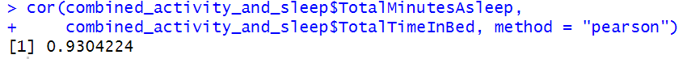

# BellaBeat Case Study
This is a capstone project from the [Google Data Analytics Course](https://www.coursera.org/account/accomplishments/professional-cert/MCV7M8S6FE55?utm_source=link&utm_medium=certificate&utm_content=cert_image&utm_campaign=sharing_cta&utm_product=prof) that I enrolled in October 2023. 
<br><br>

<a id="about-bellabeat"></a>
## About BellaBeat
Bellabeat’s passion revolves around women's health. Founded in 2013 by Urška Sršen and Sando Mur, it is a high-tech company with a global reach, manufacturing smart products that prioritize health. Their primary goal is to create exquisitely designed technology that empowers and motivates women worldwide, providing them with valuable information and inspiration.
<br>
#

_The case study follows the six step data analysis process:_

### ❓ [Ask](#1-ask)
### 💻 [Prepare](#2-prepare)
### 🛠 [Process](#3-process)
### 📊 [Analyze](#4-analyze)
### 📋 [Share](#5-share)
### 🧗‍♀️ [Act](#6-act)
<br>

## 1. Ask
💡 **BUSINESS TASK: Utilize the Fitbit Fitness Tracker dataset to derive potential growth opportunities and provide data-driven recommendations to their marketing operations team.**

#### Questions to guide the analysis:
1. What are some trends in smart device usage?
2. How could these trends apply to Bellabeat customers?
3. How could these trends help influence Bellabeat's marketing strategy?

#### Key Stakeholders
- **Urška Sršen:** Bellabeat’s co-founder and Chief Creative Officer
- **Sando Mur:** Mathematician and Bellabeat co-founder; key member of the Bellabeat executive team
- **Bellabeat marketing analytics team:** A team of data analysts responsible for collecting, analyzing, and reporting data that helps guide Bellabeat’s marketing strategy
<br>

## 2. Prepare 
The data for this analysis is sourced from Mobius via [Kaggle](https://www.kaggle.com/datasets/arashnic/fitbit), comprising the Fitbit Fitness Tracker Data. It is released under a CC0: Public Domain license, signifying the creator's relinquishment of copyright claims. This dataset encompasses personal fitness tracker records from 30 users, offering minute-level data on physical activity, heart rate, and sleep. It encompasses daily activity, steps, and heart rate, shedding light on user behavior. These datasets were collected through a distributed Amazon Mechanical Turk survey conducted between 03.12.2016 and 05.12.2016. In total, there are 18 .csv files organized in a long format.

#### ROCC analysis
- Reliable: **LOW** – Collected from 30 individuals with undisclosed gender.
- Original: **LOW** – Obtained via a third-party survey on Amazon Mechanical Turk.
- Comprehensive: **MEDIUM** – Includes various fields on daily activity, calorie expenditure, daily steps, sleep duration, and weight records.
- Current: **MEDIUM** – Data is 5 years old, but lifestyle habits tend to evolve slowly.
- Cited: **HIGH** – Thorough documentation of data collection and source
<br>

## 3. Process
[Back to Top](#about-bellabeat)

R Studio was chosen for this analysis due to its abundant packages and data visualization features that facilitate thorough data exploration.

#### Environment Setup
Install and load the packages.
```
# Install the packages
install.packages("tidyverse")
install.packages("janitor")
install.packages("skimr")
install.packages("lubridate")
install.packages("ggplot2")
install.packages("dplyr")

# Load the packages
library(tidyverse)
library(janitor)
library(skimr)
library(lubridate)
library(ggplot2)
library(dplyr)
```
Select the directory of the file for the datasets to be imported from.<br>
_Keyboard shortcut: **CRTL + SHIFT + H**_
```
# Set working directory
setwd("C:/Users/DELL/Downloads/bellabeat/Fitabase Data 4.12.16-5.12.16")
head(list.files())
```
This analysis will focus on dailyActivity, dailyCalories, dailySteps, and dailySleep datasets.
Importing the datasets.
```
# Importing datasets
daily_activity <- read.csv("dailyActivity_merged.csv")
daily_calories <- read.csv("dailyCalories_merged.csv")
daily_steps <- read.csv("dailySteps_merged.csv")
daily_sleep <- read.csv("sleepDay_merged.csv")
```

#### Cleaning the data
Inspect data for any formatting errors.
```
# Inspect format errors
str(daily_activity)
str(daily_calories)
str(daily_steps)
str(daily_sleep)
```


Following a quick review of the output, there are a few issues that need to be addressed:
- daily_activity$ActivityDate — Is formatted as CHR, not as a date format
- daily_calories$ActivityDay — Is formatted as CHR, not as a date format
- daily_steps$ActivityDay — Is formatted as CHR, not as a date format
- daily_sleep$SleepDay — Is formatted as CHR, not as a date format, and time is included

To fix those issues, several steps will be done:
- Data in said columns will be converted to a date format.
- By using pipeline, the weekday is determined and inserted into a new column, Weekday, for the analysis. 
- Time included in daily_sleep$SleepDay will be separated as it is not needed in this analysis.
```
# Convert to date & determine weekdays
daily_activity <- daily_activity %>% 
  mutate(ActivityDate = as.Date(ActivityDate,"%m/%d/%Y"),
  Weekday = weekdays(ActivityDate))
daily_calories <- daily_calories %>%
  mutate(ActivityDay = as.Date(ActivityDay, "%m/%d/%Y"),
  Weekday = weekdays(ActivityDay))
daily_steps <- daily_steps %>% 
  mutate(ActivityDay = as.Date(ActivityDay, "%m/%d/%Y"),
  Weekday = weekdays(ActivityDay))
daily_sleep <- daily_sleep %>% 
  mutate(Weekday = weekdays(as.Date(SleepDay, "%m/%d/%Y")))

# Separating date from time
cleaned_daily_sleep <- daily_sleep %>% 
  separate(SleepDay, c("Date", "Time"), " ")

# Converting Date column to date format
cleaned_daily_sleep$Date <- as.Date(cleaned_daily_sleep$Date, "%m/%d/%Y")
```


Next, check for duplicates.
```
# Check for duplicates
daily_activity %>% duplicated() %>% sum()
daily_calories %>% duplicated() %>% sum()
daily_steps %>% duplicated() %>% sum()
cleaned_daily_sleep %>% duplicated() %>% sum()
```


cleaned_daily_sleep dataset has 3 duplicates; thus, it needs to be removed.
```
# Removing duplicates & check again
cleaned_daily_sleep <- cleaned_daily_sleep %>% distinct() %>% drop_na()
cleaned_daily_sleep %>% duplicated() %>% sum()
```


Then, check the number of participants in each dataset.
```
# Checking number of participants
n_distinct(daily_activity$Id)
n_distinct(daily_calories$Id)
n_distinct(daily_steps$Id)
n_distinct(cleaned_daily_sleep$Id)
```


#### Merging the data
Finally, combining the data frames for daily_activity and cleaned_daily_sleep will enable us to evaluate potential correlations between the variables in both tables.
```
# Renaming ActivityDate column to Date
daily_activity <- daily_activity %>% rename(Date = ActivityDate)

# Combining daily_activity with cleaned_daily_sleep on both Id & Date
combined_activity_and_sleep <- merge(daily_activity, cleaned_daily_sleep,
                                     by = c("Id", "Date"))
```
<br>

## 4. Analyze
[Back to Top](#about-bellabeat)

#### Statistical summaries 
After cleaning the data, it's time to examine the statistical summaries for daily_activity, daily_steps, and cleaned_daily_sleep datasets.
```
# Statistical summaries
daily_activity %>% 
  select(VeryActiveMinutes, FairlyActiveMinutes, LightlyActiveMinutes,
         SedentaryMinutes) %>%
  summary()
daily_steps %>% select(StepTotal) %>% summary()
cleaned_daily_sleep %>% select(TotalMinutesAsleep) %>% summary()
```


Observations from the statistical summaries above:
- The majority of the participants are lightly active.
- The average sedentary minutes were 991.2, which is 16.5 hours a day.
- The average number of steps per day is 7638.
- The average time spent asleep was 419.2 minutes, which equates to 7 hours per day.
<br>

#### Further analysis
Visualizations depicting the relationships between the variables within the datasets were created.<br>

Finding the relationship between average steps and weekdays:
```
# Compute average steps per day
average_steps_per_day <- daily_steps %>%
  group_by(Weekday) %>%
  summarise(AverageSteps = mean(StepTotal))

# Placing weekdays in order
daily_steps$Weekday <- factor(
  daily_steps$Weekday, levels = c("Sunday", "Monday", "Tuesday", "Wednesday",
                                  "Thursday", "Friday", "Saturday"))

# Visualise average steps per day
ggplot(average_steps_per_day, aes(x = Weekday, y = AverageSteps)) +
  geom_col(fill = 'skyblue') +
  labs(title = "Average Steps Taken per Day", x = "Day of the Week",
       y = "Average Steps")
```


Upon analyzing the bar graph showing the average daily steps, it's evident that users tend to take the most steps on Tuesdays and Saturdays, followed by Mondays and Wednesdays. In contrast, they take the fewest steps on Sundays.

Next, finding the relationship between total steps and calories burned:
```
# Visualise total steps against calories burned
ggplot(daily_activity, aes(x = TotalSteps, y = Calories)) +
  geom_point(color = 'orange') + geom_smooth() +
  labs(title = "Total Steps vs Calories Burned", x = "Total Steps", y =
      "Calories Burned")
```


```
# Compute the correlation between total steps and calories burned
cor(daily_activity$TotalSteps, daily_activity$Calories, method = "pearson")
```


By examining the scatterplot and the computed correlation coefficient between total steps and calories burned, it is evident that there is a strong positive relationship between these two variables. As users' total steps increase, the amount of calories burned also increases. This is supported by the correlation coefficient being closer to 1.

Finding the relationship between total minutes asleep and sedentary minutes:
```
# Visualise total minutes asleep against sedentary minutes
ggplot(combined_activity_and_sleep,
       aes(x = TotalMinutesAsleep, y = SedentaryMinutes)) + 
  geom_point(color = 'maroon') + geom_smooth() +
  labs(title = "Total Minutes Asleep vs Sedentary Minutes",
       x = "Total Minutes Asleep", y = "Sedentary Minutes")
```


```
# Compute the correlation between total minutes asleep and sedentary minutes
cor(combined_activity_and_sleep$TotalMinutesAsleep,
  combined_activity_and_sleep$SedentaryMinutes, method = "pearson")
```


After looking at the scatterplot and the computed correlation coefficient above, it's apparent that there exists a negative correlation between SedentaryMinutes and TotalMinutesAsleep. This implies that users who become less active tend to get less sleep.

Lastly, finding the relationship between total minutes asleep and total minutes in bed :
```
# Visualise total minutes asleep against total minutes in bed
ggplot(cleaned_daily_sleep, aes(x = TotalMinutesAsleep, y = TotalTimeInBed)) +
  geom_point() + geom_smooth() +
  labs(title = 'Total Minutes Asleep vs Total Minutes in Bed',
       x = 'Total Minutes Asleep', y = 'Total Minutes in Bed')
```


```
# Compute the correlation between total minutes asleep and total minutes in bed
cor(combined_activity_and_sleep$TotalMinutesAsleep,
    combined_activity_and_sleep$TotalTimeInBed, method = "pearson")
```


The scatterplot clearly shows a linear relationship between total minutes in bed and total minutes asleep. This is supported by the calculated correlation coefficient close to 1, indicating a strong relationship between these variables.
<br>

## 5. Share 
[Back to Top](#about-bellabeat)

For visualizations related to this project, please refer to the [Analyze section](#4-analyze) where they are comprehensively detailed.
<br>

## 6. Act
[Back to Top](#about-bellabeat)

#### Conclusion
Based on the analysis, the following conclusions can be drawn:
- Though the average daily steps are above 6,000, users’ average sedentary minutes is too high, which is 16.5 hours a day, and they are also mostly lightly active.
- Users who are active during the day and prepare for bed early get more sleep.
- As total steps increase, the amount of calories burned increases.

#### Product Recommendations
- Bellabeat’s Leaf and Time should incorporate an alert system that notifies users when they’ve been sedentary for too long.
- A reward system like personalized badges or an AI companion that celebrates every positive lifestyle progression should be implemented to motivate users to be more active.
- Improve or add a product that could track sleep better, like sleep phases and time spent in each phase.
- Bellabeat should consider adding gentle sleep reminders to their products for users to prepare for bed early.

#### Marketing Strategy Recommendations
- Bellabeat could explore partnerships with brands in wellness, sports, and health industries to offer incentives such as coupons or store discounts to users who consistently maintain a healthy lifestyle.
- Bellabeat could host a lucky draw on their app with chances to win one of their products.
